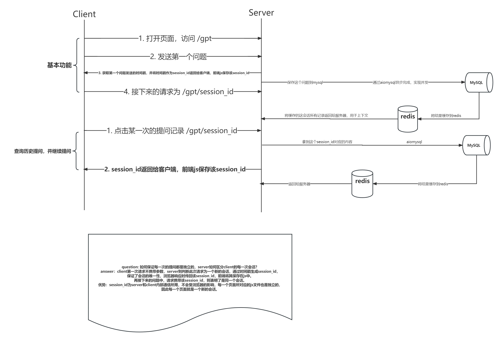

# MY_GPT

## 架构设计图

## 日志

1. 存入mysql的数据，以历史记录的方式可视化在前端，用户点击访问某一次的记录，可以继续那次的对话
2. 点击历史记录后，从mysql拿到那一次之前的所有消息并缓存在redis
3. sendBeacon() 为了避免chrome在onBeforeUnload事件中禁用fetch
4. mysql查询到的数据是tuple，redis不能用tuple、list，选用string，使用eval将string转化成list、tuple
5. 重构前端
6. 点击历史对话 -> 将mysql的数据缓存到redis。**最后同步缓存的时候，插入新增加的对话，并更新message的时间**
7. 修改了read_yaml的路径，将`\\`改成了`/`,否则linux识别不了

## css属性积累

1. `word-wrap: break-word`,很多字母连在一起会被浏览器误认为是一个单词，而不会换行，因此需要设置此属性
2. `width: fit-content` 和 `maxWidth: 50%`实现div宽度的自适应
3. `clear: both`实现让设置了`float`的div可以独占一行